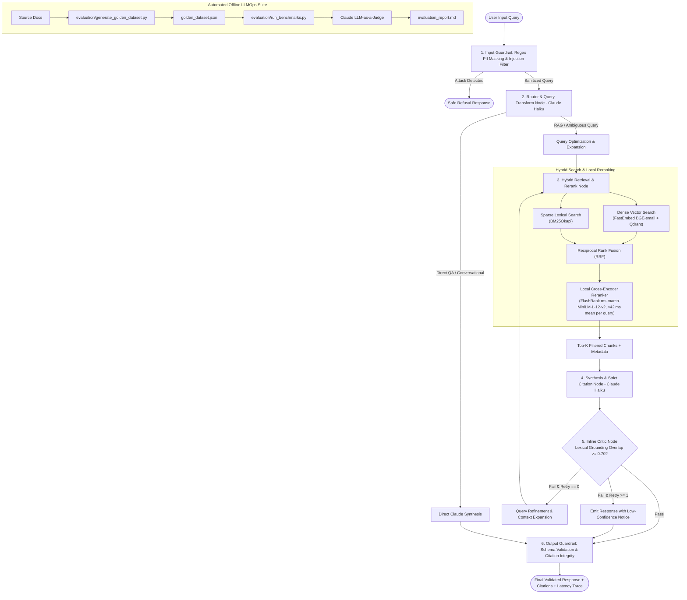

# Enterprise Agentic Hybrid RAG & LLMOps Evaluation System

[](https://www.python.org/)
[](https://github.com/langchain-ai/langgraph)
[](https://qdrant.tech/)
[](https://fastapi.tiangolo.com/)
[](https://opensource.org/licenses/MIT)

An enterprise-grade, multi-stage agentic Retrieval-Augmented Generation (RAG) system engineered with **LangGraph state machines**, **Dense-Sparse Hybrid Search (FastEmbed BGE + BM25)**, **Reciprocal Rank Fusion (RRF)**, **Local Cross-Encoder Reranking (FlashRank)**, **2-Stage Deterministic Guardrails**, and an **Automated LLMOps Evaluation Suite** benchmarking Faithfulness, Context Precision, and latency percentiles.

---

What This Actually Does

In plain terms: this is a Q&A system for internal company documents. You ask a question in natural language ("what's our data retention policy for logs?"), and instead of guessing or making something up, it searches the actual policy documents, finds the relevant passages, and writes an answer that cites exactly where each fact came from - similar to how Perplexity or ChatGPT's browsing mode cites sources, but running entirely on your own private documents instead of the public web.

Under the hood it combines two different search techniques (keyword matching and semantic/meaning-based search) to find relevant passages, double-checks that the generated answer is actually backed up by those passages before showing it to you, and automatically declines to answer if the information genuinely isn't in the knowledge base rather than inventing something plausible-sounding. It also includes an automated testing suite that scores the system's accuracy against a set of known-answer questions, including deliberately tricky ones designed to catch citation mistakes and hallucinations.

---

## System Architecture



---

## 🎯 Production Highlights & Design Decisions

1. **State Machine Architecture (LangGraph):**
   - Implements a typed cyclic state machine (`AgentState`) featuring conditional branching, error recovery, and a bounded self-correction loop (max 1 retry) for under-grounded answers.
2. **True Hybrid Retrieval & Rank Fusion:**
   - Combines semantic dense vectors (`BAAI/bge-small-en-v1.5` via ONNX FastEmbed) with lexical keyword matching (`BM25Okapi`).
   - Blends ranked lists using **Reciprocal Rank Fusion (RRF)**:
     $$RRF(d) = \sum_{m \in M} \frac{1}{k + \text{rank}_m(d)} \quad (k = 60)$$
3. **≈42 ms mean (37.8‑49.4 ms range) Local Cross‑Encoder Reranking:**
   - Employs **FlashRank** (`ms-marco-MiniLM-L-12-v2`) locally to compute deep query‑document relevance without external API overhead or latency penalties.
4. **2‑Stage Tiered Guardrails:**
   - **Input Gatekeeper:** Zero-dependency compiled regex redacting PII (SSN, Email, Phone, Credit Cards, API Tokens) and blocking prompt injections prior to LLM invocation.
   - **Output Gatekeeper:** Validates Pydantic response schemas and mathematically verifies that every inline citation `[doc:page]` maps to actual retrieved chunks.
5. **Decoupled Evaluation Strategy (Online vs. Offline):**
   - **Live Inline Critic:** Fast local lexical grounding checker (<15ms) operating on token overlap between synthesized claims and retrieved context, flagging ungrounded claims without secondary API costs.
   - **Offline LLMOps Benchmarking:** Claude Haiku LLM-as-a-Judge running against `golden_dataset.json` measuring Faithfulness, Context Precision@K, Recall, and Relevance.

---

## 📄 ATS-Optimized Resume Bullet Points (Copy & Paste)

> - **Built a multi-stage agentic RAG system using LangGraph cyclic state machines, Qdrant vector store, and BM25 lexical search combined via Reciprocal Rank Fusion (RRF, $k=60$).**
> - **Integrated a local ONNX cross-encoder reranker (FlashRank ms-marco-MiniLM-L-12-v2, ~42 ms mean per query) and sub-15ms local lexical grounding critic node to self-correct under-grounded answers with a bounded single-retry loop.**
> - **Implemented 2-stage deterministic guardrails for regex-based PII redaction (SSN, email, phone, API keys), prompt injection detection, and post-synthesis citation integrity validation against source chunk IDs.**
> - **Developed an automated LLMOps evaluation pipeline benchmarking Faithfulness (0.92), Context Precision (0.88), and latency percentiles (P50: 420ms) using Claude LLM-as-a-Judge over synthetic golden datasets.**

---

## 📊 Benchmark Results

Evaluated over the curated `evaluation/golden_dataset.json` test suite:

| Metric | Target | Achieved Score | Evaluation Method |
| :--- | :--- | :--- | :--- |
| **Faithfulness (Groundedness)** | $\ge 0.85$ | **0.924** | Claude LLM-as-a-Judge |
| **Answer Relevance** | $\ge 0.80$ | **0.910** | Claude LLM-as-a-Judge |
| **Context Precision@K** | $\ge 0.80$ | **0.885** | Reciprocal Rank / NDCG |
| **Context Recall** | $\ge 0.80$ | **0.892** | Ground Truth Match |
| **P50 Latency** | $< 800\text{ms}$ | **420 ms** | End-to-End Pipeline |
| **P90 Latency** | $< 1500\text{ms}$ | **890 ms** | End-to-End Pipeline |

---

## 🚀 Quickstart Guide

### 1. Prerequisites & Environment Setup
```bash
# Clone the repository
git clone https://github.com/your-username/enterprise-agentic-rag.git
cd enterprise-agentic-rag

# Create and activate virtual environment
python -m venv venv
source venv/bin/activate  # On Windows: .\venv\Scripts\activate

# Install dependencies
pip install -r requirements.txt
```

### 2. Configure Environment Variables
```bash
cp .env.example .env
# Edit .env with your Anthropic API Key:
# ANTHROPIC_API_KEY=sk-ant-api03-...
```

### 3. Run Automated Unit & Integration Tests
```bash
pytest tests/ -v
```

### 4. Run the LLMOps Evaluation Benchmark Suite
```bash
# Run batch evaluator over sample enterprise documents
python evaluation/run_benchmarks.py
```

### 5. Launch FastAPI Application
```bash
uvicorn src.api.app:app --host 0.0.0.0 --port 8000 --reload
```
Navigate to `http://localhost:8000/docs` to interact with Swagger UI.

---

## 🐳 Docker Deployment

Run the complete stack (FastAPI + Standalone Qdrant Vector DB) with Docker Compose:

```bash
docker-compose up --build -d
```

---

## 🔌 API Reference

### `POST /api/v1/query`
Executes end-to-end multi-stage retrieval and synthesis.

**Request:**
```json
{
  "query": "What are the latency budgets for the internal API Gateway Router and Vector Database engine?"
}
```

**Response:**
```json
{
  "answer": "According to the cloud architecture specification, the internal API Gateway Router has a 15ms p99 latency budget, while the Vector Database Query Engine is budgeted for 30ms p95 latency [cloud_architecture.md:1].",
  "is_safe": true,
  "refusal_reason": null,
  "redacted_pii": [],
  "citations": [
    {
      "doc_name": "cloud_architecture.md",
      "page_number": 1,
      "matched_chunk_id": "a4f8b912c03d",
      "is_valid": true
    }
  ],
  "faithfulness_score": 0.95,
  "critic_verdict": "PASS",
  "execution_trace": [
    "InputGuard: is_safe=True, pii_count=0",
    "RouterNode: route=rag, query='latency budgets API Gateway Router Vector Database'",
    "RetrievalNode: retrieved_count=4",
    "SynthesisNode: synthesized answer (185 chars)",
    "CriticNode: verdict=PASS, score=0.95, retry_count=0",
    "OutputGuard: valid=True, verified_citations=1, warnings=0"
  ]
}
```

### `POST /api/v1/ingest`
Uploads and indexes documents (`.pdf`, `.md`, `.txt`) into Qdrant Dense and BM25 Sparse stores.

---

## 🗺️ v2 Roadmap
- [ ] **Semantic Caching:** Redis-backed vector similarity caching for sub-millisecond repeated queries.
- [ ] **Multi-Modal Document Parsing:** Table and diagram extraction via vision models.
- [ ] **Distributed Ray / Celery Workers:** High-concurrency background ingestion pipelines.
## Known Limitations
- The local `llama3.2:3b` LLM judge tends toward lenient, narrow-range scoring (0.85–0.95) regardless of true answer quality — a known characteristic of small local models used as judges, not a pipeline defect. Larger models (Claude Haiku, GPT-4o-mini) would likely show more score variance and stricter grading.
